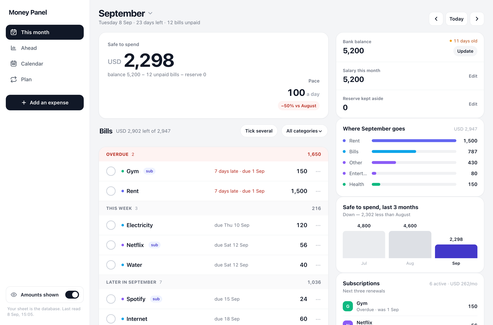
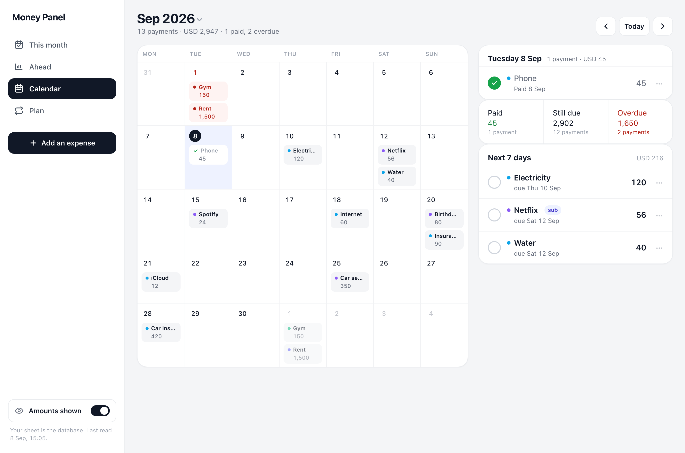
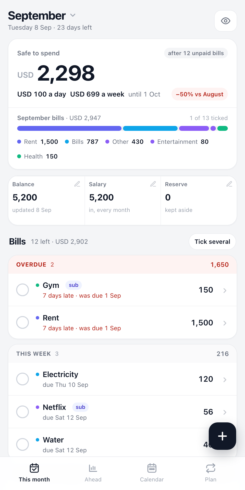
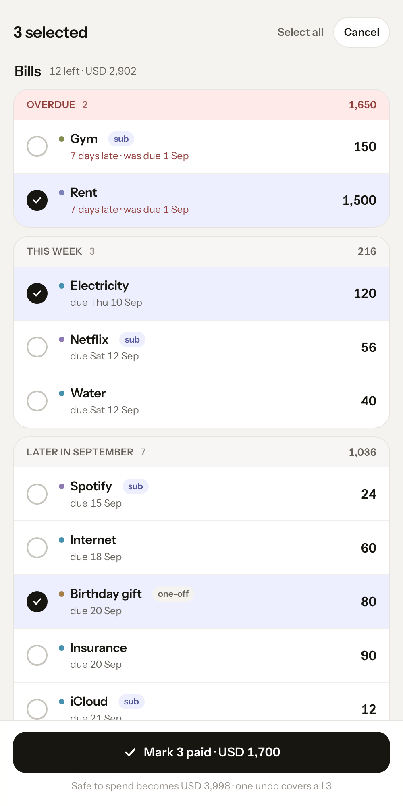
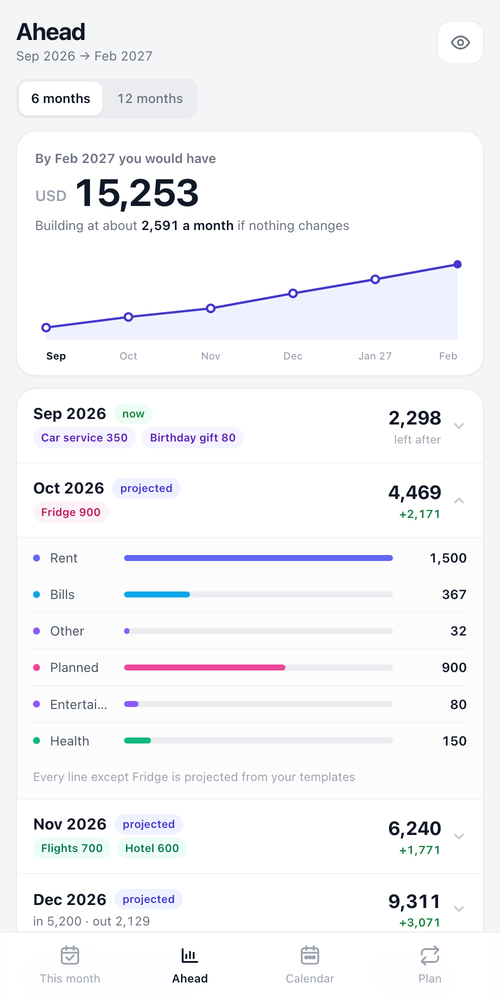
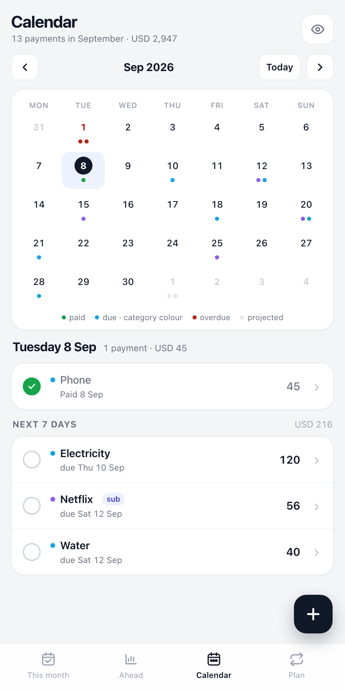
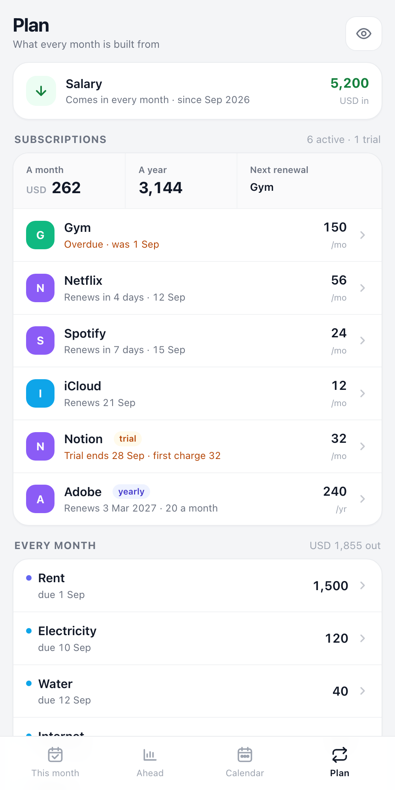
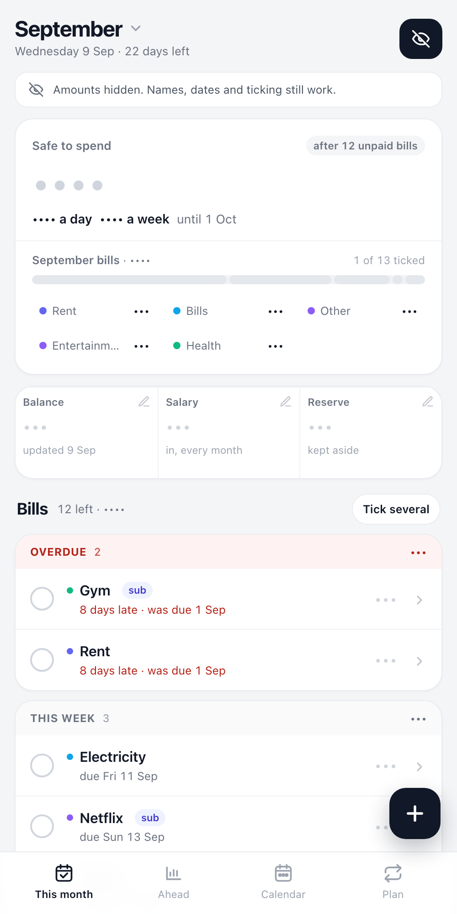

# Money Panel

A monthly money plan that lives in your own Google Sheet and opens like an app on your
phone. Salary in, bills out, what is left, and what next month looks like.

It is **not** a transaction tracker. You don't log every coffee. You plan the month,
tick bills as you pay them, and see what's left to spend.

- Runs entirely inside your Google account as an Apps Script web app. Nothing to host, no
  third-party service sees your numbers.
- The spreadsheet is the database. Every tab stays hand-editable.
- Works on phone and desktop. Add the URL to your home screen.
- Others can be given a view-only link.

<table>
  <tr>
    <td align="center"> <b>This month</b> — safe to spend, bills by due date</td>
    <td align="center"> <b>Tick several</b> — payday in one action</td>
    <td align="center"> <b>Ahead</b> — running balance, one-offs in their month</td>
  </tr>
  <tr>
    <td align="center"> <b>Calendar</b> — every payment on its day</td>
    <td align="center"> <b>Plan</b> — subscriptions, templates, reserve rule</td>
    <td align="center"> <b>Private</b> — one switch hides every amount</td>
  </tr>
</table>

## What you get

| Tab | What it shows |
|---|---|
| **This month** | **Safe to spend** = bank balance − unpaid bills − reserve, with the daily pace until payday and a comparison with last month once there is history. Bills are grouped by when they are due: **Overdue**, **This week**, **Later**, and a collapsed **Paid** summary. One tap marks a bill paid (with undo); **Tick several** marks a batch in one go with one undo. A category glance bar shows where the month goes and filters the list. |
| **Ahead** | The next 6 or 12 months as a running-balance line, one row per month with the month-over-month change, and one-offs (a fridge, a trip) shown as chips inside the month they land in. Months you have not opened yet are projected from your templates. |
| **Calendar** | Every payment on the day it is due or was paid. Tap a day to see it, tick from there, and see the next seven days. Overdue days are red, paid ones green, months you have not opened yet are shown faded. |
| **Plan** | What every month is built from: **subscriptions** with their next renewal and a monthly and yearly total, the bills that repeat every month, the ones that come now and then, and the **reserve rule** you set once. |

**Subscriptions** are templates with a switch on. They still land as bills in This month and
get ticked there; Plan lists them sorted by next renewal, with a free-trial date that
delays the first charge. **Categories** can be added from any form's category picker, with a
colour, and are stored in the Settings tab like everything else.

Balance, salary and reserve are one tap each. A single eye button hides every amount while
names, dates, overdue flags and ticking keep working. On a wide screen the tabs move into a
left rail and This month gains a second column: balance freshness, where the month goes,
safe-to-spend over the last three months, and what next month looks like.

## Install (about ten minutes, no coding)

1. Create a **new, empty Google Sheet** (or use any sheet; the app adds its own tabs and
   never touches the others).
2. In the sheet, open **Extensions → Apps Script**.
3. Replace the contents of `Code.gs` with this repo's [`Code.gs`](Code.gs).
4. Click **+** next to Files, choose **HTML**, name it `Index`, and paste in
   [`Index.html`](Index.html).
5. Open **Project Settings** (gear icon), tick **Show "appsscript.json" manifest file**, go
   back to the editor and replace its contents with [`appsscript.json`](appsscript.json).
   While you are in Project Settings, set your **time zone**.
6. **Deploy → New deployment**. Click the gear next to "Select type" and pick **Web app**
   (not Library). Execute as **Me**; who has access: **Anyone with Google account**. Deploy,
   approve the permissions, and copy the URL that ends in `/exec`.
7. Open that URL. The first visit creates the tabs and shows a short welcome form:
   currency, monthly salary, current balance. Then add your bills in the Plan tab, with the
   day of the month each one is due so they sort into Overdue / This week / Later.

Add the URL to your phone's home screen and it behaves like an app.

### Updating later

Paste the new files in, then **Deploy → Manage deployments → pencil → Version: New
version → Deploy**. Saving code in the editor alone does not change what the `/exec` URL
serves.

### Using the command line instead

If you prefer `clasp`: `npx @google/clasp login`, copy `.clasp.json.example` to
`.clasp.json`, paste your Script ID from Project Settings, then `npx @google/clasp push`.

## How it thinks

- **Balance is typed in, not synced.** You enter what the bank shows, when you check it.
  Twice a month is plenty: after payday and once mid-month.
- **A month is filled in the first time you open it.** Recurring templates become pending
  rows for that month. From then on the rows are independent of the template.
- **Paid rows are history.** Nothing deletes them automatically.
- **Removing a bill** offers two choices: delete it from this month only, or stop it after
  a month you pick. Stopping removes only unpaid rows in later months.
- **Editing a template** updates unpaid rows from the current month on (optional). A new
  template is added to any month you have already opened where it is due.
- **Reserve** is money you keep in the account but do not spend. Set a monthly rule once in
  Plan; record what you actually set aside each month from This month (negative takes some
  back). The total accumulates and comes off safe-to-spend. The forecast keeps the rule aside
  for months you have not opened.
- **Due dates** are optional. A template's due day of month becomes each row's due date,
  clamped to the month's length. Rows without one sit under "Later".
- **Subscriptions** are ordinary templates with `kind = subscription`. A `trial_ends` date
  means no row is created for a month whose due date falls on or before it. Yearly ones
  count a twelfth toward the monthly figure.
- **Last month's comparison** uses what safe-to-spend actually was, recorded as you use the
  app. It stays hidden until there are two months of history, so it never shows an invented
  number.

## The tabs it creates

| Tab | Columns |
|---|---|
| `Items` | id, month, name, category, amount, status, paid_on, source, template, notes, due_on |
| `Months` | month, salary, balance, balance_updated, expanded, reserve, left_snapshot |
| `Recurring` | id, name, category, amount, every_n_months, start_month, end_month, active, due_day, kind, trial_ends |
| `Settings` | key, value (`currency`, `categories`, `category_colors`, `reserve_monthly`) |

Columns are only ever appended. A sheet from an earlier version gets the new headers added
automatically the next time the owner opens the app, and every new column is optional.

Months are `YYYY-MM`. To change the expense categories or the currency, edit the
`categories` and `currency` rows in `Settings`. Default categories are Rent, Bills, School,
Travel, Other, Planned.

## Sharing a view-only link

Anyone with a Google account who opens your URL sees the same screens with all edit
controls hidden. The server rejects any write that does not come from the deploying
account. If edit controls are missing when *you* open it, set `OWNER_EMAIL` at the top of
`Code.gs` to your account address and deploy a new version.

## Development

`node dev/test.js` runs the real `Code.gs` against an in-memory spreadsheet shim.

`python3 -m http.server 8765` in this folder, then open
`http://127.0.0.1:8765/dev/preview.html` to click through the UI with sample data.
`?fresh=1` shows the first-run welcome flow; `?viewer=1` simulates a non-owner;
`?tab=ahead&open=2`, `?tab=calendar`, `?tab=plan`, `?select=3`, `?mask=all` and `?stale=1` jump to a state for
screenshots. The images in `docs/` were taken with headless Chrome against that preview at
a 500px-wide window (1360px for the desktop shot).

## Not included (yet)

- Importing history from an older sheet
- Currency conversion
- Reminders for due bills

MIT licensed. Built with Google Apps Script, plain HTML and JavaScript, no dependencies.
