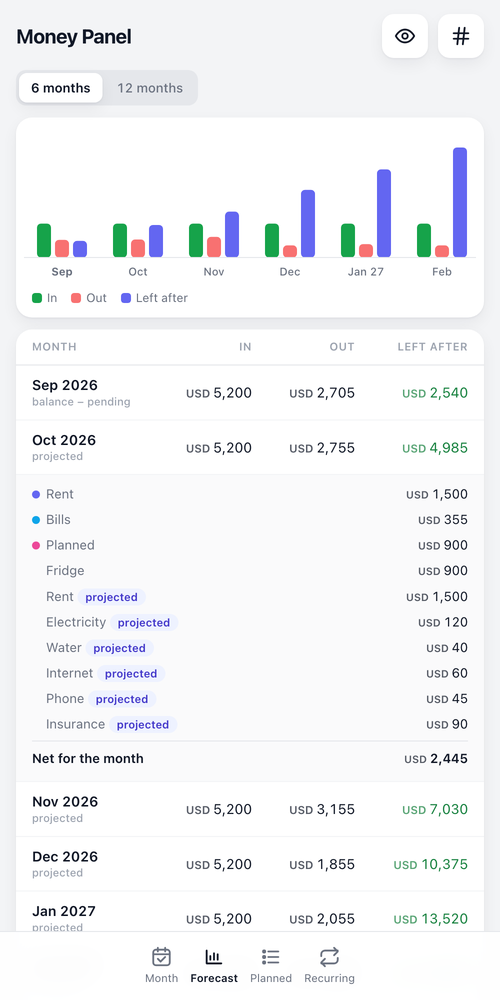
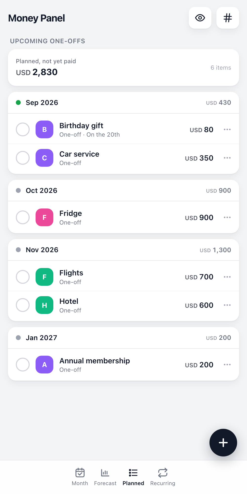
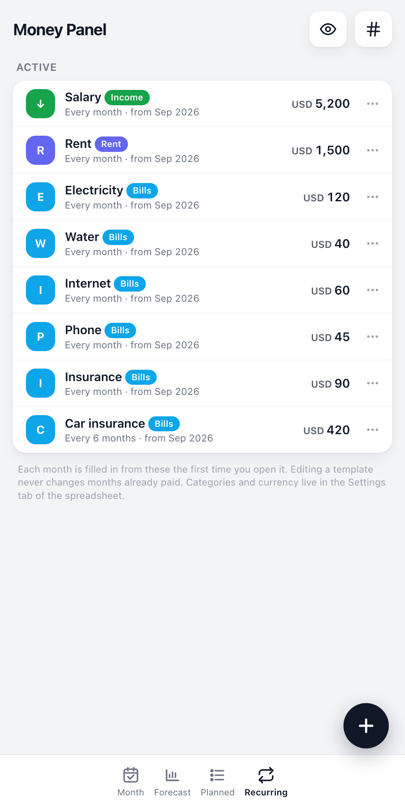

# Money Panel

A monthly money plan that lives in your own Google Sheet and opens like an app on your
phone. Salary in, bills out, what is left, and what next month looks like.

It is **not** a transaction tracker. You don't log every coffee. You plan the month,
tick bills as you pay them, and see what's left to spend.

- Runs entirely inside your Google account as an Apps Script web app. Nothing to host, no
  third-party service sees your numbers.
- The spreadsheet is the database. Every tab stays hand-editable.
- Works on phone and desktop. Add the URL to your home screen.
- Others can be given a view-only link.

<table>
  <tr>
    <td align="center"> <b>Month</b> — what is left, bills to tick off</td>
    <td align="center"> <b>Forecast</b> — the next months, expanded</td>
    <td align="center"> <b>Planned</b> — one-offs by month</td>
  </tr>
  <tr>
    <td align="center"> <b>Recurring</b> — the templates</td>
    <td align="center"> <b>Privacy</b> — balance and salary hidden</td>
    <td align="center"> <b>First open</b> — three questions and you are in</td>
  </tr>
</table>

## What you get

| Tab | What it shows |
|---|---|
| **Month** | Left for expenses = bank balance − bills still pending − money kept in reserve. Bills grouped by category, one tap to mark paid (with undo). Paid bills stay listed under "Paid". |
| **Forecast** | The next 6 or 12 months: salary, expenses, and the running "left after" figure. Months you have not opened yet are projected from your recurring bills plus anything you have planned. |
| **Planned** | One-off things coming up: a fridge, a trip, a repair. Grouped by month so you can see what lands when. |
| **Recurring** | Your templates: rent every 2 months, electricity every month, insurance every 6, salary. Each month fills itself in from these. |

Two privacy buttons in the top bar: one hides salary, balance and left-for-expenses; the
other hides every number. Handy when someone is looking over your shoulder.

## Install (about ten minutes, no coding)

1. Create a **new, empty Google Sheet** (or use any sheet; the app adds its own tabs and
   never touches the others).
2. In the sheet, open **Extensions → Apps Script**.
3. Replace the contents of `Code.gs` with this repo's [`Code.gs`](Code.gs).
4. Click **+** next to Files, choose **HTML**, name it `Index`, and paste in
   [`Index.html`](Index.html).
5. Open **Project Settings** (gear icon), tick **Show "appsscript.json" manifest file**, go
   back to the editor and replace its contents with [`appsscript.json`](appsscript.json).
   While you are in Project Settings, set your **time zone**.
6. **Deploy → New deployment**. Click the gear next to "Select type" and pick **Web app**
   (not Library). Execute as **Me**; who has access: **Anyone with Google account**. Deploy,
   approve the permissions, and copy the URL that ends in `/exec`.
7. Open that URL. The first visit creates the tabs and shows a short welcome form:
   currency, monthly salary, current balance. Then add your bills in the Recurring tab.

Add the URL to your phone's home screen and it behaves like an app.

### Updating later

Paste the new files in, then **Deploy → Manage deployments → pencil → Version: New
version → Deploy**. Saving code in the editor alone does not change what the `/exec` URL
serves.

### Using the command line instead

If you prefer `clasp`: `npx @google/clasp login`, copy `.clasp.json.example` to
`.clasp.json`, paste your Script ID from Project Settings, then `npx @google/clasp push`.

## How it thinks

- **Balance is typed in, not synced.** You enter what the bank shows, when you check it.
  Twice a month is plenty: after payday and once mid-month.
- **A month is filled in the first time you open it.** Recurring templates become pending
  rows for that month. From then on the rows are independent of the template.
- **Paid rows are history.** Nothing deletes them automatically.
- **Removing a bill** offers two choices: delete it from this month only, or stop it after
  a month you pick. Stopping removes only unpaid rows in later months.
- **Editing a template** updates unpaid rows from the current month on (optional). A new
  template is added to any month you have already opened where it is due.
- **Reserve** is money you keep in the account but do not spend. Record what you set aside
  each month (negative takes some back); the total accumulates and comes off "left for
  expenses". The forecast assumes you keep setting aside the latest amount.

## The tabs it creates

| Tab | Columns |
|---|---|
| `Items` | id, month, name, category, amount, status, paid_on, source, template, notes |
| `Months` | month, salary, balance, balance_updated, expanded, reserve |
| `Recurring` | id, name, category, amount, every_n_months, start_month, end_month, active |
| `Settings` | key, value |

Months are `YYYY-MM`. To change the expense categories or the currency, edit the
`categories` and `currency` rows in `Settings`. Default categories are Rent, Bills, School,
Travel, Other, Planned.

## Sharing a view-only link

Anyone with a Google account who opens your URL sees the same screens with all edit
controls hidden. The server rejects any write that does not come from the deploying
account. If edit controls are missing when *you* open it, set `OWNER_EMAIL` at the top of
`Code.gs` to your account address and deploy a new version.

## Development

`node dev/test.js` runs the real `Code.gs` against an in-memory spreadsheet shim.

`python3 -m http.server 8765` in this folder, then open
`http://127.0.0.1:8765/dev/preview.html` to click through the UI with sample data.
`?fresh=1` shows the first-run welcome flow; `?viewer=1` simulates a non-owner;
`?tab=forecast&open=2` and `?mask=sens` jump to a state for screenshots. The images in
`docs/` were taken with headless Chrome against that preview at a 500px-wide window.

## Not included (yet)

- Importing history from an older sheet
- Currency conversion
- Reminders for due bills

MIT licensed. Built with Google Apps Script, plain HTML and JavaScript, no dependencies.
